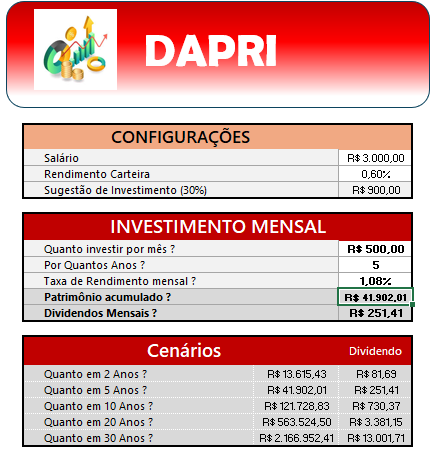

# Controle-de-Investimentos-com-Excel

Este repositório contém minha solução e experiência com o desafio proposto durante o curso **[Santander - Excel com Inteligência Artificial]**.

## 📌 Descrição

Desafio em desenvolver uma ferramenta prática de simulação de investimentos em fundos imobiliários com o excel. A planilha deverá ajudar o usuário a realizar simulações, e auxiliar a tomar decisões mais informadas sobre seus investimentos. A solução proposta visa automatizar cálculos complexos, como o valor total investido, o patrimônio acumulado e os dividendos mensais, proporcionando ao usuário uma visão clara de seu potencial retorno.

## 🚀 Tecnologias Utilizadas

- Excel
- Git e GitHub
- Markdown

## 🧠 Aprendizados

- Com esse desafio aprendi a utilizar comandos e formulas avançadas com o excel.
- O Conteúdo ministrado estava bem claro e de fácil entendimento.

## 🖼️ Capturas de Tela

As imagens estão disponíveis na pasta `/images`.

## 📂 Estrutura do Projeto

meu-desafio/

├── README.md

├── images/

│ └── captura1.png

## ✍️ Autor

**Priscila do P. Monteiro**  
[PriscilaPMonteiro](https://github.com/PriscilaPMonteiro)
